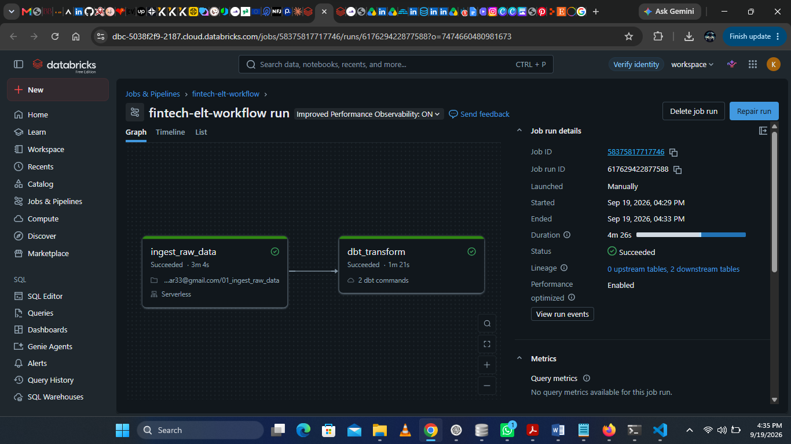

# Fintech ELT Pipeline


End-to-end ELT pipeline built with Databricks, Delta Lake, and dbt on the IEEE-CIS Fraud Detection dataset (590K+ transactions).

## Architecture

```
Raw CSV → Unity Catalog Volume → Databricks Notebook (PySpark) → Delta Tables → dbt → Mart Tables
```

## Tech Stack

| Layer | Tool |
|---|---|
| Compute | Databricks Serverless |
| Storage | Delta Lake (Unity Catalog) |
| Transformation | dbt Core 1.12 |
| Language | Python, PySpark, SQL |
| Dataset | IEEE-CIS Fraud Detection (590K transactions) |

## dbt Models

```
models/
├── staging/
│   ├── stg_transactions.sql         # Clean raw transaction data
│   └── stg_identity.sql             # Clean identity data
├── intermediate/
│   └── int_transactions_enriched.sql  # Join transactions + identity, add risk fields
└── mart/
    ├── mart_fraud_summary.sql           # Daily fraud rates by product, card, amount tier
    └── mart_high_risk_transactions.sql  # Risk-scored transactions (score >= 2)
```

## Pipeline Steps

1. **Ingest** — PySpark notebook reads CSVs from Unity Catalog Volume → writes Delta tables (`workspace.fintech.raw_transactions`, `workspace.fintech.raw_identity`)
2. **Transform** — dbt runs 5 models across staging → intermediate → mart layers
3. **Test** — 6 dbt data tests: `unique`, `not_null`, `accepted_values`


## Workflow Run (Databricks)



Both tasks succeeded in 4m 26s:
- `ingest_raw_data` — PySpark ingestion (3m 4s)
- `dbt_transform` — dbt run + test (1m 21s)


## dbt Test Results

```
Done. PASS=6 WARN=0 ERROR=0 SKIP=0 TOTAL=6
```

## Key Findings

- 590,540 transactions across 2017–2019
- Fraud rate varies significantly by product category and card network
- High-risk transactions identified by multi-factor risk scoring (transaction amount, missing identity, proxy IP, missing email domain)

## Dataset

[IEEE-CIS Fraud Detection](https://www.kaggle.com/c/ieee-fraud-detection) — 590K transactions, Vesta Corporation